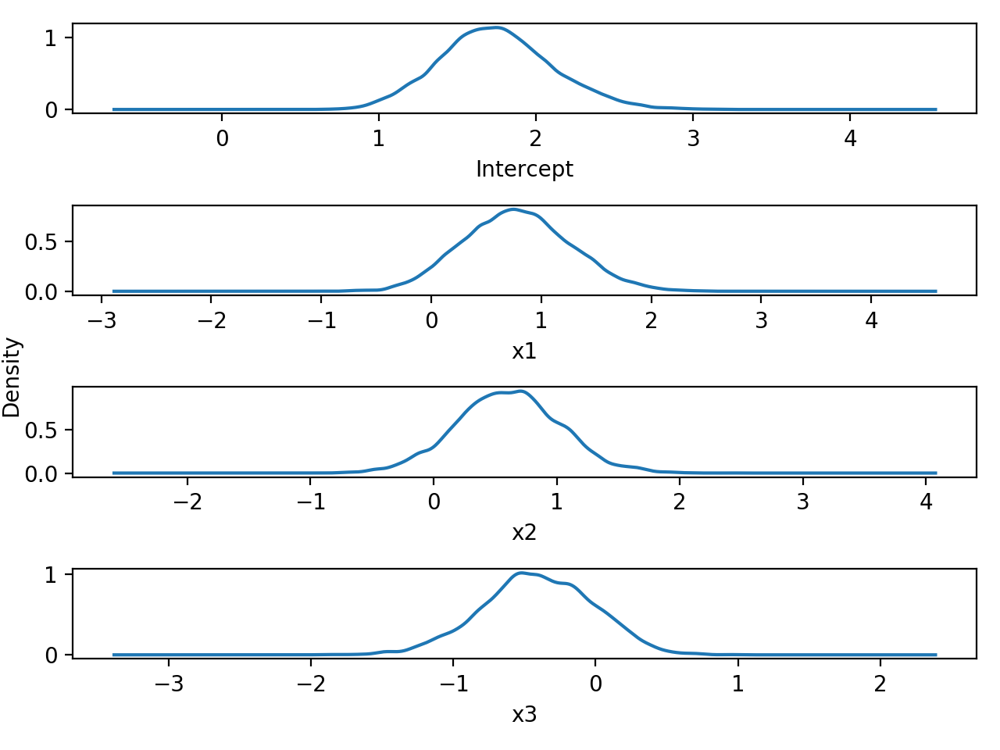

Bernoulli Response Data Example
========

In this example we will look at a small simulated data set that consists of three predictor variables and a binary response variable. Here we will use a Bernoulli GLM with the logit link function. The model specification is as follows:

<p align="center">
</p>
<p align="center">
</p>
<p align="center">
</p>

For our priors we will specify:
<p align="center">
</p>
<p align="center">
</p>

Now we will go through how to fit this model in bayesglm. 

First import the required bayesglm modules along with pandas and read the data.
```python
import pandas
from bayesglm.bglm import glm
from bayesglm.distributions import Binomial, Normal, Uninformed

data = pandas.read_excel("data/bernoulli_data.xls", header=None)
data.columns = ["y", "x1", "x2", "x3"]
```

Now we are going to fit a simple linear model with no interaction terms but first, lets specify some priors for our model parameters and store them in a list.

```python
priors = {
    "Intercept" : Uninformed(),
    "x1"        : Normal(mu=0, sigma=3),
    "x2"        : Normal(mu=0, sigma=3),
    "x3"        : Normal(mu=0, sigma=3)
}
```

Now lets specify some initial starting positions for out chain.
We will create a dictionary of starting positions.
```python
initial_pos={"Intercept":2, "x1":1, "x2":0, "x3":0}
```

We are now ready to specify our 'glm' model object.

```python
model = glm(formula="y ~ x1 + x2 + x3",
            priors=priors,
            family=Binomial(link='logit'),
            data=data)
```

We are now ready to run the Metropolis-Hastings Algorithm for our model. This is done via the "fit" method on our model object. Here we will run for 30,000 samples with the first 5,000 as burn-in.

```python
model.fit(chain_length=30000, burn_in=5000, initial_pos=initial_pos)
```
This will produce the following output as the chains update.
```
[=====================================================================>] 30000/30000 (2 seconds)
```

Now that we have produced some posterior samples, lets look at the model summary using the "summary" method.

```python
model.summary()
```
```
                                Bayesian GLM Summary
------------------------------------------------------------------------------------
DIC: 72.4154        | Chain iters : 30000  | Formula :   y ~ .          
N  : 76             | Burn-in     : 5000   | Family  :   binomial(link=logit)
------------------------------------------------------------------------------------
Node       Prior        Mean        s.d.      [2.5%        97.5%]       Acc. Rate
------------------------------------------------------------------------------------
Intercept  uninformed   1.747       0.360     1.077        2.496        0.284       
x1         normal       0.782       0.486     -0.127       1.764        0.301       
x2         normal       0.606       0.422     -0.215       1.451        0.260       
x3         normal       -0.406      0.390     -1.189       0.322        0.259       
------------------------------------------------------------------------------------
```

As we can see the summary shows a range of information about our fitted model. In particular we see that bayesglm has tuned the sample acceptance rate to around 30%, within the optimal 20-40% range for good chain mixing. 

Now plot the chain traces.
```python
model.plot_chain_trace(burn_in=False)
plt.show()
plt.close()
```


We may also plot the density of the samples chains.

```python
model.plot_chain_densities()
plt.show()
plt.close()
```




    
    